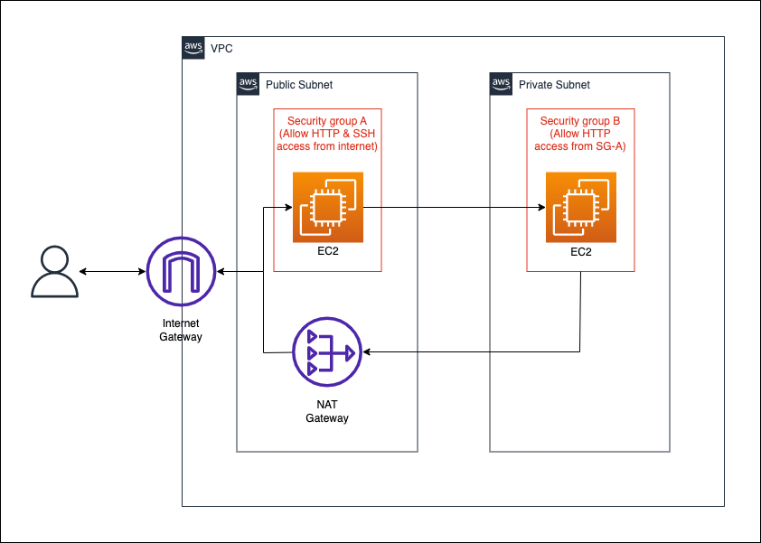

# Terraform AWS Getting Started
This project demonstrates how to provision a simple infrastructure on AWS using Terraform.
> Note: Provisioning this infrastructure might incur some cost.

## Architecture Diagram



The infrastructure includes a vpc containing a public subnet and a private subnet. We have one EC2 instance in the public subnet and another in the private subnet. The instance in the public subnet is accessible over the internet and through ssh while the one in the private instance is only accessible from the public instance.

<br>

## Folder Structure
```
terraform-aws-getting-project
├── LICENSE
├── README.md
├── main.auto.tfvars
├── main.tf
├── main.variables.tf
├── modules
│   ├── instance
│   │   ├── main.tf
│   │   ├── output.tf
│   │   └── variables.tf
│   ├── sg
│   │   ├── main.tf
│   │   ├── output.tf
│   │   └── variables.tf
│   ├── subnet
│   │   ├── main.tf
│   │   ├── output.tf
│   │   └── variables.tf
│   └── vpc
│       ├── main.tf
│       ├── output.tf
│       └── variables.tf
├── provider.tf
├── terraform.tfstate
├── terraform.tfstate.backup
└── user_data.tpl
```
The `modules` folder contains different components containing multiple resources that are used togetther, and configurable through variables in the `variables.tf` file within their respective folder. These modules are being referred to in the `main.tf` file in the project root. The variables values are being set in the `main.variables.tf` and `main.auto.tfvars`.

<br>

## Provision Infrastructure

1. Initialize terraform by running the following command
    ```
    terraform init
    ```
2. Provision infrastructure by running the following command:
    ```
    terraform apply --auto-approve
    ```

Note the output values provided by terraform once the infrastructure is provisioned.

`public_ec2_ip`: IP Address of the public ec2 instance

`public_ec2_ssh_command`: Command to ssh into the public ec2 instance

You can verify that the public ec2 instance is accessible over the internet by opening the `public_ec2_ip` in your browser.

To access the private instance you would need to get the private ip address of the private ec2 instance by going to the AWS EC2 Console. Once you have it, ssh into the public ec2 instance and run the following command:
```
curl <private_instance_ip>
```
Replace the placeholder `<private_instance_ip>` by the ip address of your private ec2 instance.

<br>

## Destroy Infrastructure
Destroy the infrastructure by running the following command:
```
terraform destroy --auto-approve
```